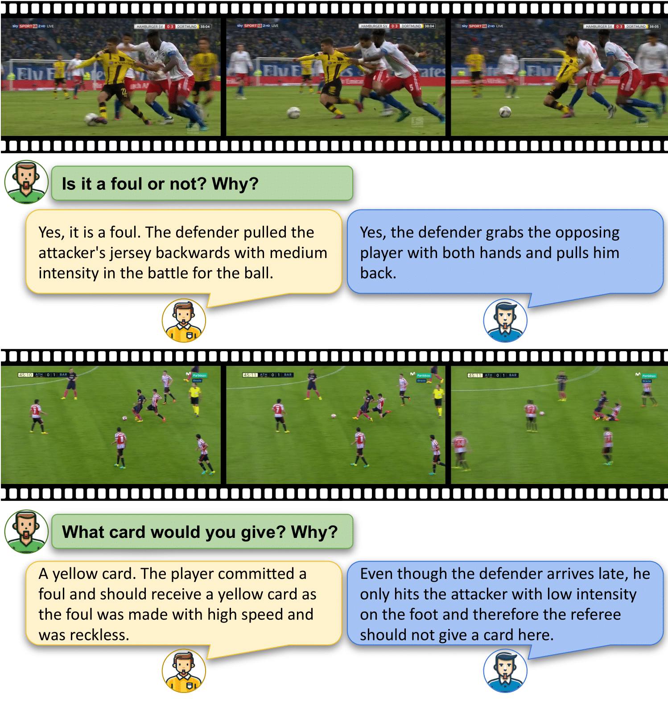
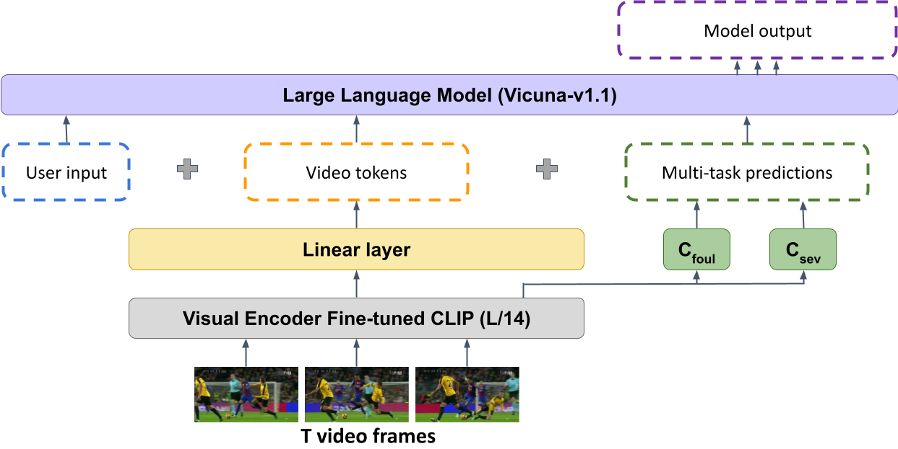
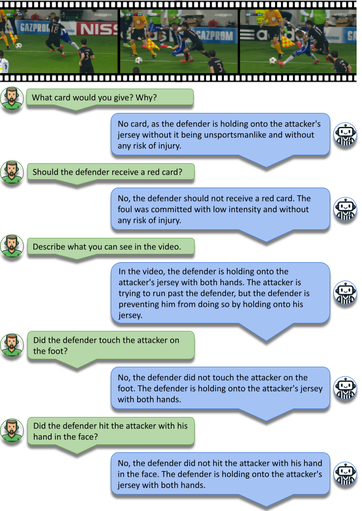
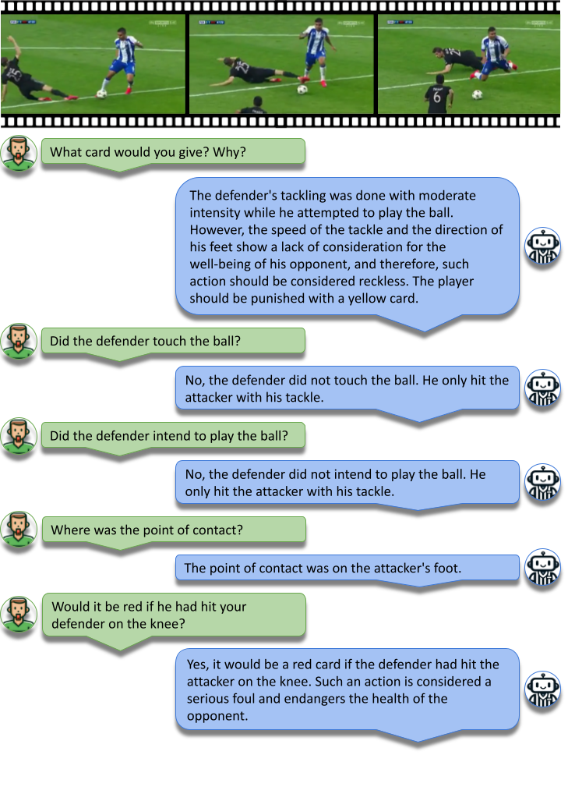
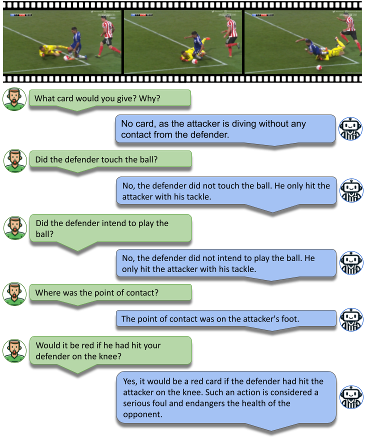

# ⚽️Explainable Video Assistant Referee System⚽️ 

| Paper | Demo Clips | Dataset | Model | Training | Offline Demo | Examples |
| :---: | :---: | :---: | :---: | :---: | :---: | :---: | 
|  |    | [SoccerNet-XFoul](#SoccerNet-XFoul) | [X-VARS](#X-VARS) | [Training](#Training) |  [Offline Demo](https://github.com/heldJan/X-VARS/blob/main/X-VARS/demo.md) |  [Examples](#Examples) |

This repository contains: 
- **SoccerNet-XFoul**, a novel dataset consisting of more than **22k video-question-answer** triplets annotated by over 70 experienced football referees. 🚀
- **X-VARS**, a new vision language model that can **perform multiple multi-modal tasks** such as visual captioning, question-answering, video action recognition, and can generate explanations of its decisions on-par with human level. 🤖
- The code to run an **offline demo on your laptop**. 💻

## SoccerNet-XFoul

The SoccerNet-XFoul dataset consists of 22k video-question-answer pairs annotated by more than 70 experienced referees. 
Due to the subjectivity in refereeing, we gathered multiple answers for the same action, rather than collecting a single decision and explanation for each question. In the end, for each action, we have, on average, $1.5$ answers for the same question.

The dataset will be available soon! Stay tuned🔥

## X-VARS

X-VARS is a visual language model based on a **fine-tuned CLIP visual encoder** to extract **spatio-temporal video features** and to obtain **multi-task predictions** regarding the type and severity of fouls. The **linear layer** connects the vision encoder to the language model by projection the video features in the text embedding dimension. We input the **projected spatio-temporal features** alongside **the text predictions** obtained by the two classification heads (for the task of determining the type of foul and the task of determining if it is a foul and the corresponding severity) into the Vicuna-v1.1 model, initialized with weights from LLaVA.

## Training 

We propose a two-stage training approach. **The first stage** fine-tunes CLIP on a multi-task classification to learn prior knowledge about football and refereeing. **The second stage** consists in fine-tuning the projection layer and several layers of the LLM to enhance the model's generation abilities in the sport-specific domain. 

More information are provided in our [paper](www.google.de).

## Examples

## Acknowledgements

 - [VARS:](https://github.com/SoccerNet/sn-mvfoul) The first multi-task classification model for predicting if it is a foul or not and the corresponding severity.
 - [Video-ChatGPT:](https://github.com/mbzuai-oryx/Video-ChatGPT) A vision and language model used as a foundation model for X-VARS

If you're using X-VARS in your research or applications, please cite our paper: 

## Authors 

- [Jan Held](https://www.linkedin.com/in/heldjan/)
- [Hani Itani](https://www.linkedin.com/in/hani-itani-613b01111/)
- [Anthony Cioppa](https://www.linkedin.com/in/anthony-cioppa-65a779128/)
- [Silvio Gincola](https://www.linkedin.com/in/silvio-giancola/)
- [Bernard Ghanem](https://www.linkedin.com/in/bernardghanem/)
- [Marc Van Droogenbroeck](https://scholar.google.com/citations?user=IQm8ljgAAAAJ&hl=en)

